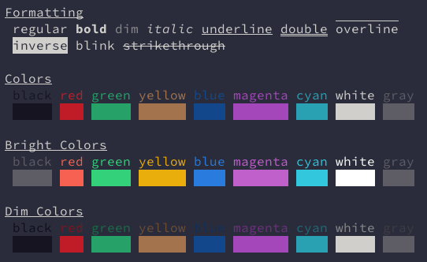

# Chalk

Easy C++20 header-only library for terminal colors. Supports user-defined string literals, string_view, string, and ostream. Uses compile-time string constants, so everything is constexpr.

### Demo ([View Code](examples/example.cpp))


### Example
```cpp
#include "chalk.h"

using namespace chalk;

// All of the following statements produce the same output
std::cout << "Hello, " << "Chalk"_red << "!\n";
std::cout << "Hello, " << Red("Chalk") << "!\n";
std::cout << "Hello, " << Red << "Chalk" << !Red << "!\n";
printf("Hello, %s!", Red("Chalk").c_str());

// Formats can be chained easily
std::cout << std::string("Hello, ") + Bold(Red.bg("Chalk")) + "!\n";
std::cout << std::string("Hello, ") + Bold + Red.bg + "Chalk" + Reset + "!\n";
```
